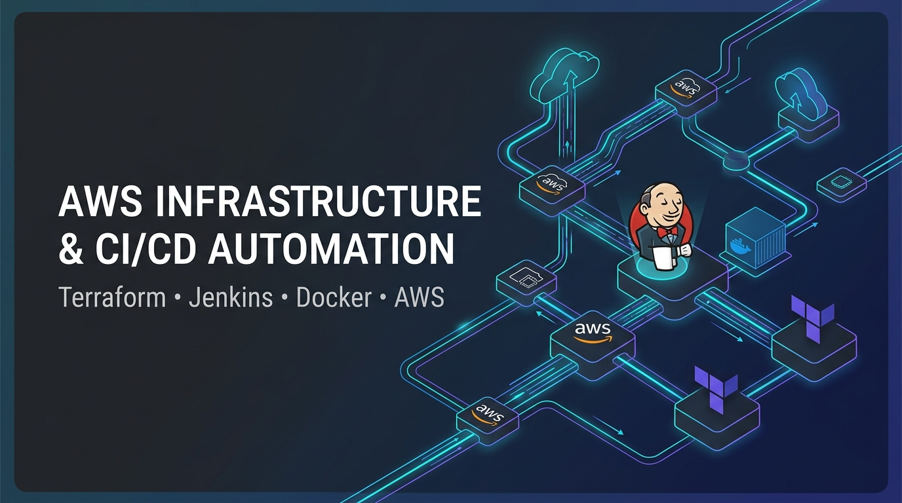
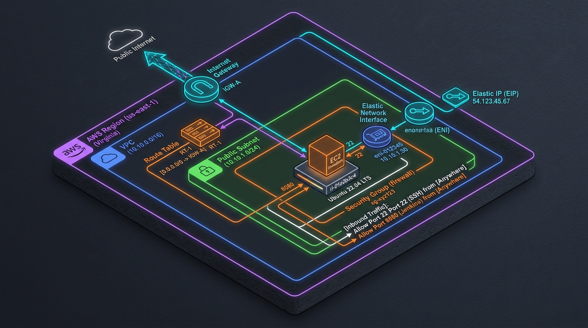
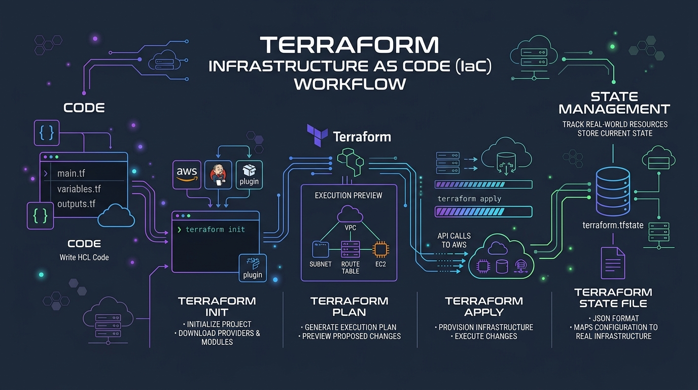
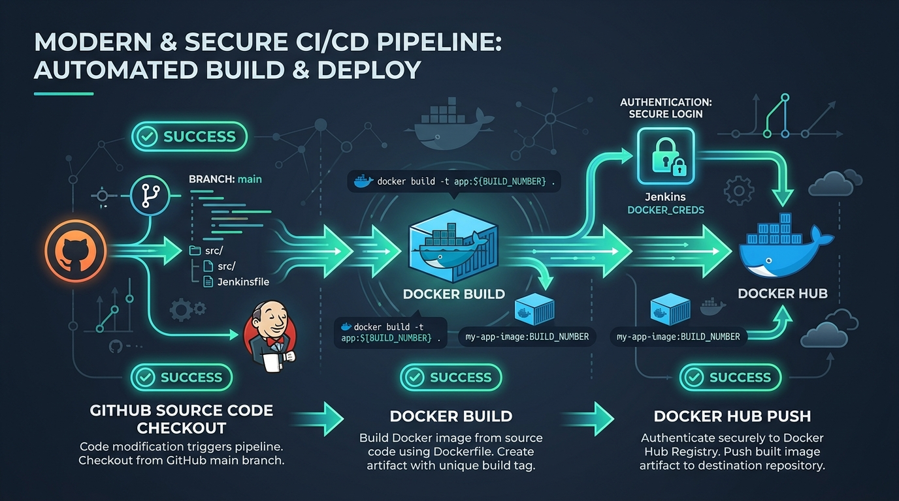
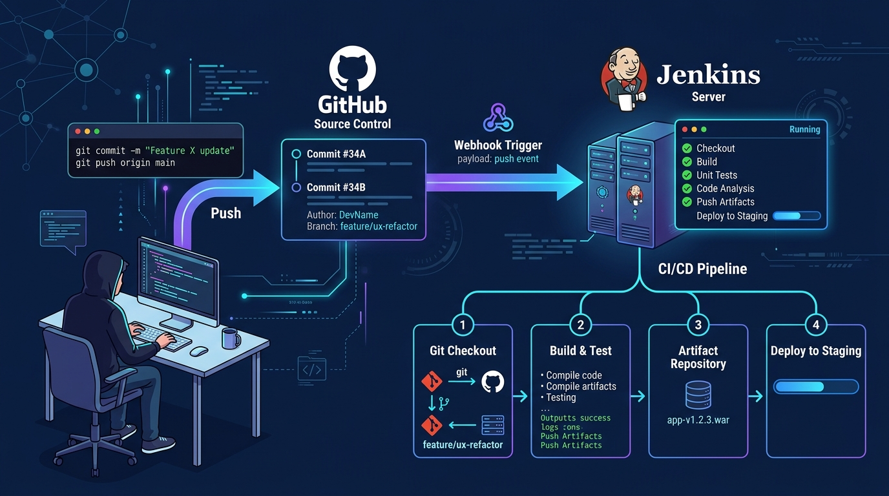
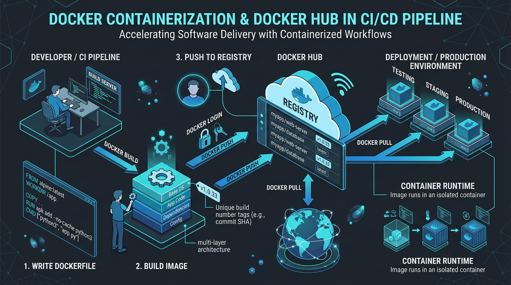
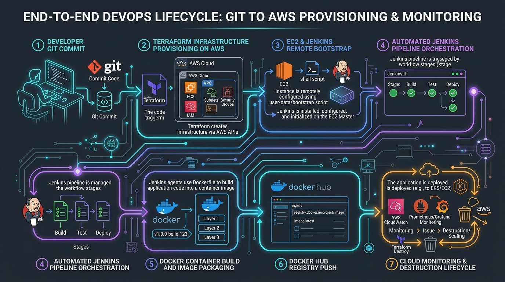

# AWS Cloud Infrastructure Automation & Declarative CI/CD Pipeline



[](https://www.terraform.io/)
[](https://aws.amazon.com/)
[](https://www.jenkins.io/)
[](https://www.docker.com/)
[](https://hub.docker.com/)
[](https://opensource.org/licenses/MIT)

> **Repository Tagline:** *End-to-End Cloud Infrastructure as Code on AWS paired with Declarative Jenkins Pipeline Automation and Container Delivery.*

---

## 1. Project Title & Introduction

### Project Title
**Production-Grade AWS Infrastructure Automation and Declarative Jenkins CI/CD Containerization Pipeline using Terraform**

### Introduction
In contemporary cloud engineering, manual provisioning of compute environments and hand-crafted build servers introduce configuration drift, operational bottlenecks, security vulnerabilities, and deployment failures. 

This repository presents an end-to-end, reproducible DevOps implementation that bridges **Infrastructure as Code (IaC)** and **Continuous Integration (CI)** automation. Utilizing **Terraform (HashiCorp)**, the project provisions an isolated, dedicated AWS Virtual Private Cloud (VPC), network interfaces, elastic routing, firewall security perimeters, and a compute instance hosting an enterprise-ready Jenkins server. Furthermore, it leverages the **Jenkins Terraform Provider** to treat CI/CD pipeline definitions themselves as version-controlled code, automatically provisioning declarative Jenkins pipelines that check out source code from GitHub, build versioned Docker artifacts, and push production containers to Docker Hub.

---

## 2. Professional Project Banner

The project visualizes the flow of modern GitOps and Infrastructure as Code:


---

## 3. Project Overview

This project implements two core architectural layers:
1. **Cloud Infrastructure Layer:** Fully automated AWS networking and compute provisioning via Terraform HCL (`main.tf`), establishing a dedicated VPC, public subnet, internet gateway, route tables, elastic network interface (ENI), elastic IP (EIP), and an Ubuntu-based EC2 instance with an automated `remote-exec` post-provisioning bootstrap script.
2. **Pipeline as Code Layer:** Orchestration of Jenkins using the community `taiidani/jenkins` Terraform provider (`jenkins/main.tf`), generating an automated Jenkins Pipeline job directly through native XML configuration that connects GitHub repositories to Docker Hub container registries.

```
+----------------------------------------------------------------------------------------------------+
|                                    PROJECT SCOPE AT A GLANCE                                      |
+------------------------------------+---------------------------------------------------------------+
| IaC Framework                      | Terraform (AWS Provider + Jenkins Provider)                   |
| Cloud Platform                     | Amazon Web Services (AWS us-east-1)                           |
| Operating System                   | Ubuntu Linux (t3.medium compute tier)                         |
| CI/CD Engine                       | Jenkins (Java 21 LTS runtime, official Debian packages)      |
| Source Control Integration         | GitHub (`someshtarra/project-management`)                     |
| Containerization Engine            | Docker Engine & Dockerfile build process                      |
| Artifact Registry                  | Docker Hub Registry (`someshtarra/projectimage`)              |
+------------------------------------+---------------------------------------------------------------+
```

---

## 4. Problem Statement

Modern software engineering teams frequently suffer from the **"It Works On My Machine"** syndrome and the **"Snowflake Server"** dilemma:
* **Manual Cloud Management:** Provisioning EC2 instances, security groups, and routing tables through the AWS Management Console leads to inconsistent environments, unrecorded changes, and human error.
* **Snowflake Build Servers:** Installing Jenkins, Java runtimes, and build dependencies manually creates servers that cannot be recreated reliably during disaster recovery.
* **Manual Build & Release Workflows:** Developers manually compiling binaries, building Docker images on local workstations, and pushing them to public registries without standardized credentials or version tagging introduces security leaks and untracked artifact releases.

---

## 5. Project Objectives

### Technical Objectives
* **Declarative Infrastructure:** Codify 100% of the AWS infrastructure using Terraform HCL to achieve deterministic and idempotent provisioning.
* **Automated Bootstrapping:** Provision an EC2 instance and automatically install Java 21, the Jenkins LTS repository, Git, and system services without manual SSH intervention.
* **Pipeline-as-Code Configuration:** Provision Jenkins jobs declaratively via the Terraform Jenkins provider, eliminating manual UI clicking in Jenkins.
* **Standardized Container Builds:** Automate GitHub repository checkouts, build parameterized Docker images tagged with dynamic build identifiers (`${BUILD_NUMBER}`), and publish them to Docker Hub.

### Business Objectives
* **Reduce Lead Time to Recovery (MTTR):** Recreate the entire build infrastructure from scratch in under 4 minutes.
* **Zero Configuration Drift:** Guarantee that identical infrastructure code yields identical runtime environments across environments.
* **Secure Credential Separation:** Isolate Docker Hub credentials within Jenkins secret storage rather than in application source code.

---

## 6. Real-World Use Case

### Context: High-Velocity SaaS Product Engineering
A software company is building a containerized web application (`project-management`). Engineering teams commit code multiple times per day. The infrastructure team needs to ensure that:
1. Every microservice has an isolated, repeatable cloud build environment in AWS.
2. Every developer commit pushed to the `main` branch automatically triggers an isolated container build.
3. Every built container is tagged with an immutable build number and pushed to a secure registry for staging and deployment.
4. When testing is complete or infrastructure needs to be relocated to a different AWS region, the entire stack can be spun up or destroyed with a single command (`terraform apply` / `terraform destroy`).

---

## 7. Architecture Overview

The system architecture cleanly separates infrastructure provisioning from pipeline execution:

```
[ Developer Local Terminal ]
             │
             │ 1. terraform apply
             ▼
  ┌───────────────────────────── AWS Cloud (us-east-1) ─────────────────────────────┐
  │                                                                                 │
  │  VPC (10.10.0.0/16)                                                             │
  │  ┌───────────────────────────────────────────────────────────────────────────┐  │
  │  │ Public Subnet (10.10.1.0/24)                                              │  │
  │  │   ┌────────────────────────────────────────────────────────────────────┐  │  │
  │  │   │ Security Group (TCP 22, TCP 8080)                                  │  │  │
  │  │   │   ┌─────────────────────────────────────────────────────────────┐  │  │  │
  │  │   │   │ EC2 Instance (t3.medium)                                    │  │  │  │
  │  │   │   │  ├── Network Interface (10.10.1.6) ◄── Elastic IP (Public) │  │  │  │
  │  │   │   │  ├── Java 21 LTS + Jenkins Service (Port 8080)              │  │  │  │
  │  │   │   │  └── Git Client + Docker Build Engine                       │  │  │  │
  │  │   │   └──────────────────────────────┬──────────────────────────────┘  │  │  │
  │  │   └──────────────────────────────────┼─────────────────────────────────┘  │  │
  │  └──────────────────────────────────────┼────────────────────────────────────┘  │
  │                                         │                                       │
  │                               Internet Gateway                                  │
  └─────────────────────────────────────────┬───────────────────────────────────────┘
                                            │
                                            ▼
                    ┌───────────────────────────────────────┐
                    │          External Services            │
                    │  ├── GitHub Repository (Source Code)  │
                    │  └── Docker Hub (Container Registry)  │
                    └───────────────────────────────────────┘
```

---

## 8. Detailed Infrastructure Architecture



### Network Layout & IP Allocation
* **Virtual Private Cloud (VPC):** `10.10.0.0/16` (65,536 private IP addresses available).
* **Public Subnet:** `10.10.1.0/24` (256 addresses, hosting the primary workloads).
* **Internet Gateway:** Attached to the VPC boundary, providing NAT and routing to the public Internet.
* **Custom Route Table:** Associates destination `0.0.0.0/0` (all non-VPC outbound traffic) with the Internet Gateway.
* **Elastic Network Interface (ENI):** Static private IP allocation `10.10.1.6` attached to `device_index = 0` on the EC2 instance.
* **Elastic IP (EIP):** Allocated in the VPC domain and statically bound to private IP `10.10.1.6` on the ENI. This ensures the public IP remains static across instance stop/starts.

---

## 9. Technology Stack with Explanations

| Technology | Role in Stack | Technical Rationale |
| :--- | :--- | :--- |
| **HashiCorp Terraform** | Infrastructure as Code (IaC) | Declarative state management, dependency graph resolution, repeatable cloud resource provisioning. |
| **Amazon Web Services (AWS)** | Cloud Infrastructure Provider | Scalable, highly available IaaS primitives (VPC, EC2, Subnets, Gateways, Elastic IPs). |
| **Jenkins LTS** | CI/CD Automation Server | Extensible, battle-tested orchestration engine supporting declarative pipelines and credential storage. |
| **Ubuntu 22.04 LTS** | Base Operating System | Debian-based Linux environment with long-term kernel stability, apt package management, and systemd. |
| **OpenJDK 21** | Java Runtime Environment | Modern LTS release required to power current Jenkins core execution engines. |
| **Docker Engine** | Container Runtime & Build Tool | Builds multi-layered container images ensuring runtime portability and environment parity. |
| **Docker Hub** | Container Artifact Registry | Centralized registry for storing, versioning, and distributing production Docker images. |
| **Git & GitHub** | Distributed Version Control | Source code repository and commit tracking triggering automated CI pipelines. |

---

## 10. AWS Services and Their Responsibilities

1. **Amazon Virtual Private Cloud (Amazon VPC):** Isolates the build infrastructure into a dedicated, logically separated virtual network in the `us-east-1` region.
2. **AWS Internet Gateway (IGW):** Enables bidirectional communication between the VPC resources and the external internet (GitHub, apt repositories, Docker Hub).
3. **AWS Subnet:** Defines an IP address block within the VPC (`10.10.1.0/24`) configured for public routing.
4. **AWS Route Table & Association:** Directs outbound internet-bound traffic through the Internet Gateway.
5. **AWS Security Group (`web_sg`):** Stateful host firewall regulating inbound traffic to port 22 (SSH) and port 8080 (Jenkins UI).
6. **AWS Elastic Network Interface (ENI):** Virtual network card maintaining a fixed private IP address (`10.10.1.6`).
7. **AWS Elastic IP (EIP):** Persistent public IPv4 address providing continuous external access to the Jenkins UI.
8. **Amazon Elastic Compute Cloud (EC2):** Hardware-virtualized compute instance (`t3.medium`) providing 2 vCPUs and 4 GiB RAM for Jenkins builds.

---

## 11. Infrastructure as Code (IaC) Approach

The project adheres to HashiCorp Terraform core workflows:
* **Declarative Paradigm:** Engineers specify *what* resources are required, rather than *how* to construct them imperatively.
* **Directed Acyclic Graph (DAG):** Terraform internally models dependencies (e.g., EIP depends on Internet Gateway; Instance depends on ENI; ENI depends on Subnet and Security Group).
* **Two-Phase Decoupling:** 
  1. *Phase 1 (Base Cloud Infra):* AWS resources are provisioned, and the remote EC2 instance is configured with Jenkins.
  2. *Phase 2 (Pipeline Definition):* Once Jenkins is initialized and accessible, the Jenkins Terraform provider connects to the API and registers the pipeline job.



---

## 12. Terraform Configuration Walkthrough

### 1. Root Module (`main.tf`)
The root configuration manages AWS cloud infrastructure:

```hcl
provider "aws" {
  region = "us-east-1"
}

# 1. Isolated Virtual Private Cloud
resource "aws_vpc" "web_vpc" {
  cidr_block = "10.10.0.0/16"
  tags       = { Name = "prod_vpc" }
}

# 2. Internet Gateway for external routing
resource "aws_internet_gateway" "web_ig" {
  vpc_id = aws_vpc.web_vpc.id
  tags   = { Name = "prod_ig" }
}

# 3. Public Subnet
resource "aws_subnet" "web_sn" {
  vpc_id     = aws_vpc.web_vpc.id
  cidr_block = "10.10.1.0/24"
  tags       = { Name = "prod_sn" }
}

# 4. Route Table sending default traffic to IGW
resource "aws_route_table" "web_rt" {
  vpc_id = aws_vpc.web_vpc.id
  route {
    cidr_block = "0.0.0.0/0"
    gateway_id = aws_internet_gateway.web_ig.id
  }
  tags = { Name = "prod_rt" }
}

# 5. Association between Subnet and Route Table
resource "aws_route_table_association" "web_rta" {
  subnet_id      = aws_subnet.web_sn.id
  route_table_id = aws_route_table.web_rt.id
}
```

### 2. Network Interface, Elastic IP & Security Group
```hcl
# Host Firewall
resource "aws_security_group" "web_sg" {
  name        = "web_sg"
  description = "Security group for Jenkins server"
  vpc_id      = aws_vpc.web_vpc.id

  ingress {
    description = "SSH"
    from_port   = 22
    to_port     = 22
    protocol    = "tcp"
    cidr_blocks = ["0.0.0.0/0"]
  }

  ingress {
    description = "Jenkins Web UI"
    from_port   = 8080
    to_port     = 8080
    protocol    = "tcp"
    cidr_blocks = ["0.0.0.0/0"]
  }

  egress {
    from_port   = 0
    to_port     = 0
    protocol    = "-1"
    cidr_blocks = ["0.0.0.0/0"]
  }
  tags = { Name = "prod_sg" }
}

# Static ENI
resource "aws_network_interface" "web_nic" {
  subnet_id       = aws_subnet.web_sn.id
  security_groups = [aws_security_group.web_sg.id]
  private_ips     = ["10.10.1.6"]
  tags            = { Name = "prod_nic" }
}

# Elastic IP allocation with explicit IGW dependency
resource "aws_eip" "web_eip" {
  domain                    = "vpc"
  network_interface         = aws_network_interface.web_nic.id
  associate_with_private_ip = "10.10.1.6"

  depends_on = [aws_internet_gateway.web_ig]
  tags       = { Name = "prod_eip" }
}
```

### 3. Compute Resource with Remote Provisioner
```hcl
resource "aws_instance" "web_server" {
  ami           = "ami-0b6d9d3d33ba97d99"
  instance_type = "t3.medium"
  key_name      = "ansible"

  network_interface {
    device_index         = 0
    network_interface_id = aws_network_interface.web_nic.id
  }

  tags = { Name = "prod_server" }

  connection {
    type        = "ssh"
    user        = "ubuntu"
    private_key = file("/Users/someswararaotarra/desktop/AWS_keys/ansible.pem")
    host        = aws_eip.web_eip.public_ip
    timeout     = "10m"
  }

  provisioner "remote-exec" {
    inline = [
      "sudo apt update",
      "sudo apt install -y fontconfig openjdk-21-jre",
      "sudo wget -O /etc/apt/keyrings/jenkins-keyring.asc https://pkg.jenkins.io/debian-stable/jenkins.io-2026.key",
      "echo 'deb [signed-by=/etc/apt/keyrings/jenkins-keyring.asc] https://pkg.jenkins.io/debian-stable binary/' | sudo tee /etc/apt/sources.list.d/jenkins.list > /dev/null",
      "sudo apt update",
      "sudo apt install -y jenkins",
      "sudo apt install -y git",
      "sudo systemctl enable jenkins",
      "sudo systemctl start jenkins",
      "sudo cat /var/lib/jenkins/secrets/initialAdminPassword"
    ]
  }
}
```

---

## 13. Jenkins Installation and Configuration

The remote-exec bootstrap script executes the following automated lifecycle on the Ubuntu EC2 instance:
1. **Repository Synchronization:** Updates local apt caches.
2. **Runtime Installation:** Installs OpenJDK 21 headless runtime environment (`openjdk-21-jre`) and font libraries required by Jenkins graphic renderers.
3. **Keyring Setup:** Imports the official Jenkins repository GPG key (`jenkins.io-2026.key`) into `/etc/apt/keyrings/jenkins-keyring.asc`.
4. **Source Declaration:** Injects the Debian-stable repository source list into `/etc/apt/sources.list.d/jenkins.list`.
5. **Package Installation:** Installs the core `jenkins` daemon and `git` CLI client.
6. **Daemon Management:** Enables and boots the systemd service (`systemctl enable jenkins && systemctl start jenkins`).
7. **Password Output:** Prints the initial unlock key located at `/var/lib/jenkins/secrets/initialAdminPassword` to the provisioning console.

---

## 14. Jenkins Pipeline Workflow



The CI/CD pipeline definition is managed in `jenkins/main.tf` and submitted as a Jenkins Workflow Job (`jenkins_job.hello_job`):

```groovy
pipeline {
  agent any

  environment {
    GITHUB_REPO_URL = 'https://github.com/someshtarra/project-management.git'
    GITHUB_BRANCH   = 'main'
    DOCKER_IMAGE    = 'someshtarra/projectimage'
    DOCKER_USER     = 'someshtarra'
  }

  stages {
    stage('Checkout Stage') {
      steps {
        echo 'Checking out source code from GitHub'
        git branch: env.GITHUB_BRANCH, url: env.GITHUB_REPO_URL
      }
    }

    stage('Docker Build') {
      steps {
        echo 'Building Docker image'
        sh 'docker build -t $DOCKER_IMAGE:${BUILD_NUMBER} -f Dockerfile .'
      }
    }

    stage('Docker Hub Push') {
      steps {
        echo 'Pushing Docker image to Docker Hub'
        withCredentials([string(credentialsId: 'dockerhub', variable: 'DOCKER_HUB')]) {
          sh '''
            echo "$DOCKER_HUB" | docker login -u "$DOCKER_USER" --password-stdin
            docker push "$DOCKER_IMAGE:${BUILD_NUMBER}"
            docker logout
          '''
        }
      }
    }
  }

  post {
    success { echo 'Pipeline completed successfully!' }
    failure { echo 'Pipeline failed. Check the console output.' }
  }
}
```

### Pipeline Stage Details

| Stage Name | Purpose | Inputs | Outputs | Potential Failure Causes |
| :--- | :--- | :--- | :--- | :--- |
| **Checkout Stage** | Clones the target GitHub repository branch | Repo URL, branch `main` | Local Git repository workspace | Network partition, invalid URL, branch not found. |
| **Docker Build** | Builds container image from repository Dockerfile | `Dockerfile`, repository files, `${BUILD_NUMBER}` | Tagged local Docker image | Syntax error in Dockerfile, Docker daemon not running, missing dependencies. |
| **Docker Hub Push** | Authenticates and uploads artifact to registry | Jenkins credential `dockerhub`, username, image tag | Published image on Docker Hub | Invalid token/password, rate limits, network timeout, authentication failure. |

---

## 15. GitHub Source Code Integration



* **Repository:** `https://github.com/someshtarra/project-management.git`
* **Target Branch:** `main`
* **Trigger Mechanism:** Currently configured for manual execution / poll SCM in Jenkins. Can be upgraded to automated GitHub Webhooks (`/github-webhook/`).

---

## 16. Docker Image Build Process



1. **Context Construction:** The Jenkins agent reads the workspace root and locates the `Dockerfile`.
2. **Layer Caching:** Unchanged layers (OS packages, runtime libraries) are reused from the local Docker cache to accelerate build cycles.
3. **Immutability via Build Number:** The image is explicitly tagged with `someshtarra/projectimage:${BUILD_NUMBER}`. This ensures every build generates an identifiable, non-overwriting release artifact.

---

## 17. Docker Hub Integration

1. **Secret Ingestion:** Credentials are stored in Jenkins as a Secret Text or Username/Password with ID `dockerhub`.
2. **Standard-In Authentication:** The pipeline uses `--password-stdin` (`echo "$DOCKER_HUB" | docker login -u "$DOCKER_USER" --password-stdin`) to prevent sensitive passwords from appearing in process tables or build logs.
3. **Push & Cleanup:** The image is pushed to `hub.docker.com/r/someshtarra/projectimage`, followed by an immediate `docker logout` step to clean up registry credentials from the build host.

---

## 18. AWS Infrastructure Provisioning Sequence

The resource provisioning follows a deterministic sequence:
1. `aws_vpc.web_vpc` is created.
2. `aws_internet_gateway.web_ig` attaches to the VPC.
3. `aws_subnet.web_sn` allocates CIDR `10.10.1.0/24`.
4. `aws_route_table.web_rt` establishes route `0.0.0.0/0 -> IGW`.
5. `aws_route_table_association.web_rta` activates internet routing on the subnet.
6. `aws_security_group.web_sg` is instantiated.
7. `aws_network_interface.web_nic` is created in the subnet with SG attachment.
8. `aws_eip.web_eip` binds to the network interface.
9. `aws_instance.web_server` launches with the ENI attached.
10. `remote-exec` establishes SSH connectivity and executes the installation script.

---

## 19. End-to-End Execution Flow



1. **Infrastructure Phase:**
   * Developer executes `terraform apply` in project root.
   * AWS resources spin up; Jenkins installs on Ubuntu; public IP outputs to console.
2. **Jenkins Initialization Phase:**
   * Engineer accesses `http://<EIP>:8080`, un-locks Jenkins using the generated initial admin password, creates user `somesh`, and generates an API Token.
   * Engineer saves Docker Hub credentials in Jenkins under ID `dockerhub`.
3. **Pipeline Provisioning Phase:**
   * Engineer supplies `jenkins_api_token` to `jenkins/main.tf` and executes `terraform apply`.
   * Jenkins job `terraform-hello-job` is created.
4. **CI/CD Execution Phase:**
   * Pipeline runs: checks out GitHub code, builds Docker image with `${BUILD_NUMBER}`, and pushes to Docker Hub.

---

## 20. Project Directory Structure

```
aws-terraform-jenkins-cicd/
├── .gitignore                      # Excludes .terraform, .tfstate, .pem keys, OS metadata
├── main.tf                         # Root Terraform configuration: AWS VPC, EC2, Jenkins bootstrap
├── outputs.tf                      # (Recommended) Decoupled outputs for IP and UI URLs
├── variables.tf                    # (Recommended) Input variables for region, AMI, and CIDRs
├── assets/                         # Architecture diagrams, visual infographics, and hero banners
│   ├── hero_banner.png
│   ├── aws_architecture.png
│   ├── jenkins_pipeline.png
│   ├── terraform_iac.png
│   ├── devops_workflow.png
│   ├── docker_container.png
│   ├── github_integration.png
│   ├── devops_workstation.png
│   ├── project_lifecycle.png
│   └── repo_cover.png
├── jenkins/                        # Jenkins-as-Code Terraform Sub-module
│   ├── main.tf                     # Jenkins Provider configuration and Pipeline Job definition
│   └── variables.tf                # Sensitive API token definitions
├── scripts/                        # (Recommended) Bootstrap user_data shell scripts
│   └── install_jenkins.sh
└── docs/                           # (Recommended) Technical deep-dives and runbooks
```

---

## 21. Prerequisites & Dependencies

Before executing this project, ensure you have:
* **AWS Account:** Active account with administrative or VPC/EC2 provisioning privileges.
* **AWS CLI:** Installed and configured with `aws configure` (Access Key, Secret Key, Region `us-east-1`).
* **Terraform CLI:** Version `v1.5.0` or higher installed.
* **SSH Key Pair:** Key named `ansible` created in AWS EC2 Key Pairs with local private key (`ansible.pem`).
* **Docker Hub Account:** Active repository created at `hub.docker.com`.
* **GitHub Account:** Access to the application repository.

---

## 22. Installation and Configuration

### Step 1: Clone Repository
```bash
git clone https://github.com/someshtarra/aws-terraform-jenkins-cicd.git
cd aws-terraform-jenkins-cicd
```

### Step 2: Configure Local SSH Key Permissions
Ensure your private key has strict read-only permissions:
```bash
chmod 400 /path/to/ansible.pem
```

---

## 23. Step-by-Step Deployment Guide

### Phase 1: Provision AWS Cloud Infrastructure
```bash
# 1. Initialize Terraform plugins
terraform init

# 2. Validate configuration syntax
terraform validate

# 3. Preview resource changes
terraform plan -out=tfplan.binary

# 4. Apply changes
terraform apply tfplan.binary
```
*Outputs will display:*
```text
Apply complete! Resources: 8 added, 0 changed, 0 destroyed.

Outputs:
jenkins = "54.xxx.xxx.xxx"
jenkins_url = "http://54.xxx.xxx.xxx:8080"
```

---

## 24. Jenkins Setup and Access

1. Open your browser and navigate to `http://<EIP>:8080`.
2. Retrieve the initial admin password from the Terraform stdout, or via SSH:
   ```bash
   ssh -i /path/to/ansible.pem ubuntu@<EIP> "sudo cat /var/lib/jenkins/secrets/initialAdminPassword"
   ```
3. Install suggested plugins.
4. Create an Administrator User with username `somesh`.
5. Generate an API Token:
   * Go to **Manage Jenkins** -> **Users** -> Click **somesh** -> **Configure**.
   * Under **API Token**, click **Add new Token**, give it a name, and copy the token string.
6. Configure Docker Hub credentials:
   * Go to **Manage Jenkins** -> **Credentials** -> **System** -> **Global credentials**.
   * Add a Secret text credential with ID `dockerhub`, storing your Docker Hub Personal Access Token.

---

## 25. Pipeline Execution Walkthrough

### Phase 2: Provision Jenkins Job via Terraform
Navigate to the `jenkins` directory:
```bash
cd jenkins

# Initialize Jenkins provider
terraform init

# Apply configuration with your Jenkins API token
terraform apply -var="jenkins_api_token=<YOUR_JENKINS_API_TOKEN>"
```

### Triggering the Pipeline
1. Return to the Jenkins Web UI.
2. Select job `terraform-hello-job`.
3. Click **Build Now**.
4. Monitor the stage view as **Checkout Stage**, **Docker Build**, and **Docker Hub Push** execute sequentially.

---

## 26. Validation & Testing

```bash
# Verify Jenkins daemon is active
ssh -i /path/to/ansible.pem ubuntu@<EIP> "systemctl status jenkins"

# Verify Docker engine status
ssh -i /path/to/ansible.pem ubuntu@<EIP> "docker --version && docker ps"

# Pull and verify the uploaded image from Docker Hub
docker pull someshtarra/projectimage:1
docker run --rm -d -p 80:80 someshtarra/projectimage:1
```

---

## 27. Screenshots and Visual Demonstrations

Recommended repository screenshots for portfolio review:
* `screenshots/01-terraform-apply.png`: Console output of root module provisioning.
* `screenshots/02-aws-vpc-console.png`: AWS VPC management console showing `prod_vpc` and subnets.
* `screenshots/03-jenkins-unlocked.png`: Jenkins dashboard displaying user `somesh`.
* `screenshots/04-pipeline-stage-view.png`: Green stage view showing successful builds.
* `screenshots/05-dockerhub-registry.png`: Docker Hub repository displaying published tags (`:1`, `:2`).

---

## 28. Security Considerations

| Vector | Current Implementation | Risk / Impact | Production Mitigation |
| :--- | :--- | :--- | :--- |
| **SSH Exposure** | Port 22 open to `0.0.0.0/0` | Brute force SSH attacks | Restrict to corporate VPN / developer IP (`x.x.x.x/32`), or use AWS SSM Session Manager. |
| **Jenkins Web UI** | Port 8080 open to `0.0.0.0/0` | Unencrypted HTTP, unauthorized access | Place behind an AWS Application Load Balancer with HTTPS/TLS (ACM) and WAF. |
| **Hardcoded Paths** | Local path `/Users/.../ansible.pem` | Breaks reproducibility across team members | Use input variable `var.ssh_private_key_path` or environment variable. |
| **State Storage** | Local `terraform.tfstate` | Unencrypted state, potential concurrency collisions | Migrate to remote S3 backend with AES-256 encryption and DynamoDB state locking. |
| **Root Execution** | `remote-exec` with root SSH | Security liability on workstation failure | Refactor to EC2 `user_data` (cloud-init) scripts. |

---

## 29. Troubleshooting Guide

* **Issue: `remote-exec` hangs during `terraform apply`**
  * *Root Cause:* SSH port 22 blocked, security group rule misconfigured, or private key path incorrect.
  * *Resolution:* Validate that `ansible.pem` permissions are set to `400` and that your local IP can reach AWS port 22.
* **Issue: `docker: command not found` in Jenkins Pipeline**
  * *Root Cause:* Docker engine was not installed in the initial bootstrap script.
  * *Resolution:* SSH into the instance and run `sudo apt install -y docker.io && sudo usermod -aG docker jenkins && sudo systemctl restart jenkins`.
* **Issue: Jenkins Provider 401 Unauthorized in `jenkins/main.tf`**
  * *Root Cause:* Incorrect API token or hardcoded IP address mismatch in `server_url`.
  * *Resolution:* Ensure `server_url` reflects the actual Elastic IP and verify the API token under user settings.

---

## 30. Infrastructure Cleanup and Resource Destruction

To avoid unwanted AWS billing charges when testing is finished:

```bash
# 1. Destroy Jenkins job definition
cd jenkins
terraform destroy -var="jenkins_api_token=<YOUR_JENKINS_API_TOKEN>"

# 2. Destroy AWS Infrastructure
cd ..
terraform destroy --auto-approve
```
*Validation:* Verify in the AWS Management Console that the EC2 instance is terminated and the Elastic IP is released.

---

## 31. Challenges Faced and Engineering Solutions

1. **Circular Initialization Dependency:** The Jenkins provider requires an active, authenticated Jenkins HTTP endpoint, but that endpoint is created by Terraform itself.
   * *Solution:* Architected the solution as a decoupled two-phase workflow: foundational AWS infrastructure is provisioned first, followed by Jenkins-as-Code pipeline configuration once credentials are created.
2. **Dynamic Public IP Management:** EC2 instances change public IPs upon reboot.
   * *Solution:* Allocated a persistent AWS Elastic IP (`aws_eip`) bound directly to a static Elastic Network Interface (`aws_network_interface`) to maintain consistent endpoints for Jenkins.

---

## 32. Key Technical Learnings

* Mastered declarative cloud infrastructure orchestration with Terraform on AWS.
* Gained experience managing software configuration via `remote-exec` vs. `user_data`.
* Implemented Pipeline-as-Code using native Jenkins Groovy syntax encapsulated within Terraform.
* Hardened credential separation in CI/CD pipelines using Jenkins secret storage and `--password-stdin`.

---

## 33. DevOps Best Practices Demonstrated

* **Version Control Everything:** All infrastructure and pipeline configurations reside in Git.
* **Immutable Build Artifacts:** Every Docker image receives a distinct `${BUILD_NUMBER}` tag.
* **Idempotent Deployments:** Running `terraform apply` repeatedly produces zero drift when infrastructure matches the declared state.
* **Explicit Dependency Management:** Used `depends_on` to ensure network routes and internet gateways exist before allocating internet-facing Elastic IPs.

---

## 34. Current Limitations

* Docker Engine was omitted from the initial `remote-exec` script in `main.tf` (requires manual installation or bootstrap script update).
* Hardcoded local workstation paths in `connection` block.
* Hardcoded static server URL in `jenkins/main.tf`.
* Continuous Deployment (CD) to a runtime cluster (ECS/EKS) is not yet implemented.

---

## 35. Future Enhancements Roadmap

1. **Automated Docker Bootstrap:** Include Docker installation and `usermod -aG docker jenkins` in EC2 `user_data`.
2. **AWS Systems Manager (SSM):** Eliminate port 22 and SSH keys in favor of IAM-managed SSM Session Manager.
3. **Application Load Balancer & HTTPS:** Implement AWS ALB with ACM SSL/TLS certificates on domain name.
4. **Remote State Backend:** S3 bucket with server-side encryption (SSE-KMS) and DynamoDB state locking.
5. **Continuous Deployment (CD):** Extend pipeline to automatically deploy containers to Amazon ECS (Fargate) or Amazon EKS.
6. **Automated Image Scanning:** Integrate Trivy or Snyk in the Jenkins pipeline to scan container layers for vulnerabilities before pushing.

---

## 36. Project Conclusion

This project serves as a practical demonstration of modern cloud automation. By unifying AWS infrastructure provisioning through Terraform with automated Jenkins pipeline deployment and Docker containerization, it establishes a reliable foundation for continuous integration and cloud delivery.

---

## 37. Author Introduction

**Someswara Rao Tarra**  
*Cloud & DevOps Engineer*  
* Specialized in AWS, Terraform, Docker, Kubernetes, and CI/CD Automation.
* [GitHub Profile](https://github.com/someshtarra)  
* [LinkedIn Profile](https://www.linkedin.com/in/someshtarra/)

---

## 38. GitHub Contribution Guidelines

Contributions, issues, and feature requests are welcome!
1. Fork the Project.
2. Create your Feature Branch (`git checkout -b feature/DevOpsEnhancement`).
3. Commit your Changes (`git commit -m 'Add automated Docker bootstrap'`).
4. Push to the Branch (`git push origin feature/DevOpsEnhancement`).
5. Open a Pull Request.

---

## 39. Feedback & Collaboration

If you have questions, architectural suggestions, or would like to collaborate on cloud infrastructure automation, feel free to open an issue or connect on LinkedIn.

---

## 40. Support & Star

If this project helped you understand AWS, Terraform, or Jenkins automation, please give it a ⭐ on GitHub!
